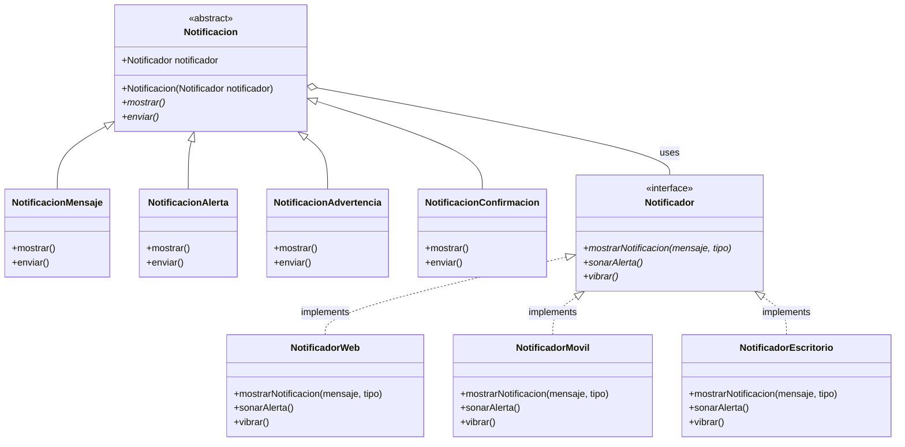

# Bridge Pattern - Sistema de Notificaciones

## Diagrama de Clases



## Explicación del Diseño

### Abstracción (Lado Izquierdo)
- **Notificacion**: Clase abstracta que define la interfaz común para todos los tipos de notificación
- **NotificacionMensaje, NotificacionAlerta, etc.**: Implementaciones concretas de diferentes tipos de notificación

### Implementación (Lado Derecho)
- **Notificador**: Interfaz que define cómo se muestran las notificaciones en diferentes plataformas
- **NotificadorWeb, NotificadorMovil, etc.**: Implementaciones concretas para cada plataforma

### Beneficios de este Diseño

1. **Escalabilidad**: Agregar un nuevo tipo de notificación solo requiere crear una nueva subclase de `Notificacion`
2. **Extensibilidad**: Agregar una nueva plataforma solo requiere implementar la interfaz `Notificador`
3. **Separación de responsabilidades**: La lógica de la notificación está separada de la lógica de presentación
4. **Flexibilidad**: Se puede cambiar la plataforma dinámicamente en tiempo de ejecución
5. **Mantenibilidad**: Cada clase tiene una responsabilidad específica y bien definida

## Ejemplo de Uso

```C# o .net
// Crear un notificador para web
Notificador notificadorWeb = new NotificadorWeb();

// Crear una notificación de mensaje para web
Notificacion mensajeWeb = new NotificacionMensaje(notificadorWeb);
mensajeWeb.mostrar(); // Se mostrará usando la implementación web

// Cambiar a móvil dinámicamente
Notificador notificadorMovil = new NotificadorMovil();
mensajeWeb.setNotificador(notificadorMovil);
mensajeWeb.mostrar(); // Ahora se mostrará usando la implementación móvil
```
