# 🚗 Descripción del Escenario

Imagina que estás desarrollando una aplicación para una compañía automotriz que permite a los clientes personalizar y ordenar un automóvil. 🏭📱

Un objeto **Automóvil** puede tener muchas configuraciones opcionales:

- ⚙️ Tipo de motor
- 🎨 Color
- 🚙️ Llantas
- 🔊 Sistema de sonido
- 🛋️ Interiores
- 🌞 Techo solar
- 🗺️ Navegación GPS
- ➕ Etc...

## ⚠️ Problema

Crear un objeto Automóvil con múltiples configuraciones puede llevar a constructores con muchos parámetros (el infame _`"constructor telescópico"`_) o a múltiples constructores sobrecargados, lo que dificulta el mantenimiento y legibilidad del código. 🧩

## 💡 Beneficios esperados de la solución

- 📖 **Legibilidad y claridad:** Facilitar la creación de objetos complejos con muchos parámetros sin necesidad de múltiples constructores o valores por defecto.
- 🛡️ **Inmutabilidad:** Una vez creado el objeto, sus propiedades no se pueden modificar si el constructor lo define como inmutable.
- 🧩 **Flexibilidad:** Poder omitir atributos opcionales sin necesidad de crear subclases o múltiples constructores.
- 🧠 **Separación de construcción y representación:** Separar la lógica de construcción del objeto en sí, facilitando modificaciones futuras.

___

# 🧩 Solución

## 🏷️ Tipo de patrón

**Creacional**  
Nos dice **cómo crear un objeto complicado** sin enredarnos con un montón de constructores.
Un Automovil tiene muchísimas opciones (motor, color, llantas, extras…), y este patrón permite armarlo paso a paso, con valores por defecto y la posibilidad de clonarlo y modificar partes sin complicar el código.

## 🧠 Patrón de diseño

**Builder**  
Sirve para armar objetos paso a paso, eligiendo solo lo que quieras sin tener que rellenar todo desde el principio. Además, una vez creado, el objeto es inmutable, lo que ayuda a evitar errores.

**Factory**  
Da recetas listas de autos según el tipo: lujo, básico, deportivo…
Es útil porque no tenemos que preocuparnos por llenar todos los campos obligatorios, la Factory ya los maneja por nosotros.

**Prototype**
Permite clonar un auto que ya existe y cambiar solo lo que necesites.
Por ejemplo, tomas un Mercedes de lujo y lo conviertes en edición especial cambiando color, modelo o cualquier otro detalle sin afectar el auto original.

**Justificación:**  
Builder deja armar autos completos paso a paso y flexibles.
Factory ahorra tiempo generando autos listos sin preocuparse de los campos obligatorios.
Prototype ofrece la ventaja de clonar un auto existente y personalizarlo al instante, sin tener que empezar desde cero.

## 🖼️ Diagrama de clases



## 💻 Código

```csharp
public class Program
{
    static void Main()
    {
        factory = new AutoDeLujoFactory();
            Automovil autoDeLujo = factory.CrearAutomovil();
            Console.WriteLine($"\n## Automóvil de Lujo:\n{autoDeLujo}");

            factory = new AutoBasicoFactory();
            Automovil autoBasico = factory.CrearAutomovil();
            Console.WriteLine($"\n## Automóvil Básico:\n{autoBasico}");

            factory = new AutoDeportivoFactory();
            Automovil autoDeportivo = factory.CrearAutomovil();
            Console.WriteLine($"\n## Automóvil Deportivo:\n{autoDeportivo}");

            var autoEspecial = new AutomovilBuilder(new AutoDeLujoFactory().CrearAutomovil())
                        .SetColor("Rojo Metalizado")
                        .SetModelo("Edición Especial")
                        .SetAño(2026)
                        .Build();

            Console.WriteLine($"\n## Automóvil Especial:\n{autoEspecial}");
    }
}
```
